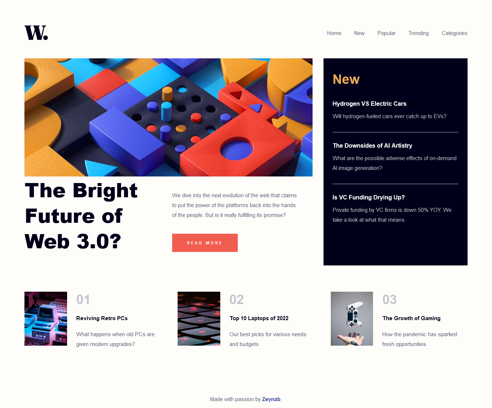
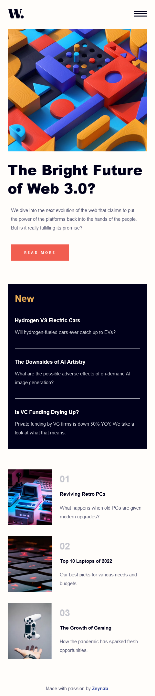
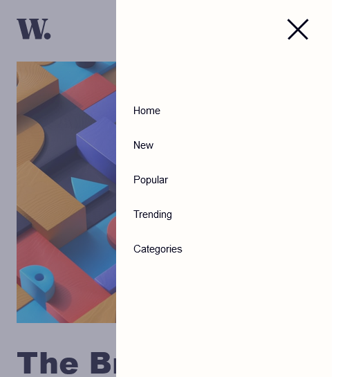

# News homepage
This is a home page for a news agency, You can see the live site demo at the address below.
My focus in this project was it to be fully responsive and used many media query to achieve that. for the responsiveness of font sizes I used calculation based on size of the viewport width.   

- Live Site URL: (https://zeynabmvs.github.io/NewsHomePage/)

## Screenshots





## Built with
- Semantic HTML5 markup
- CSS custom properties
- Flexbox
- CSS Grid
- Mobile-first workflow
- JQuery for toggle
- Gulp for generating css and running locally


## Acknowledgments
This is a solution to the [News homepage challenge on Frontend Mentor](https://www.frontendmentor.io/challenges/news-homepage-H6SWTa1MFl). Frontend Mentor challenges help you improve your coding skills by building realistic projects. 

## Run locally
- clone the repo
- install npm packages: ``` npm install ```
- run gulp :  ``` gulp ```

